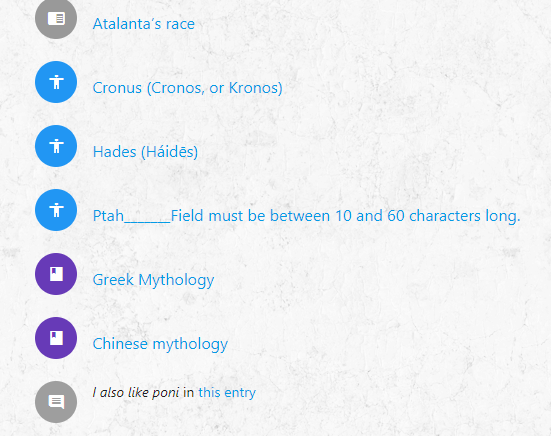

### [Project Amphora](https://https:/ci-vero-datacentric.herokuapp.com) : Data Centric Development Milestone Project

# Testing
- ### Website Responsiveness
    - Overall Responsiveness and browser compatibility
    
        - [Browserling](www.browserling.com/)
        
            This website has been tested on multiple devices and browsers to ensure utmost responsiveness.
            I have also used the website 'Browserling' for that purpose.
    
- ### Home and Navigation

    **Navigation Bar**
    
    I. The navigation bar at the top of the screen displays the name 'Amphora' and if I click on it at any point while I am browsing, I am brought back to the home page.
    
    - I.I. When I visit the page using a large viewport, the navigation bar is at the top of the screen and displays the options available. An user icon indicates where I have to click for user-relevant options (login or register during my first visit).
    
    - I.II. While visiting using my smartphone, the navigation bar is triggered when I click on the hamburger menu at the top-left of the screen. The user-related options are highlighted in the menu.
    
    ##### Elements affected by user status
    II. 
    If I am logged in, the user options available in the navigation bar change: 'Login' and 'Register' are replaced by 'Profile' and 'Logout'.
    If I click on 'Log Out', an alert message advises me that I successfully logged out and I am brought back to the home page, from wherever I was on the website. The user-relevant are defaulted to 'Login' and 'Register'.
    
    **Information displayed**
    
    I. The home page displays an introductory paragraph along with two pictures and quotes. The website is responsive, so the position of these elements change according to the size of the viewport used.
    
    **Footer**
    
    I. The footer remains identical on all pages of the website. It includes the Github logo and if I click on it, a new window brings me to the Github profile of **nuagesdencre**. 
    
- ### Repository

    #### While a visitor is anonymous:
    
    -   **Repository main page**
        
        I. The page displays a definition of the word repository, action buttons and a list of the available entries split by type. These lists are paginated and only show 3 entries of each type par page.
        
        II. Clicking on the button 'New Entry' gives two options to select from: "Add Entry: Story" and "Add Entry: Being". 
        Regardless of my choice, as I am not logged in, proceeding with the creation of an entry is not permitted. I am redirected to the login page.
        
        III. Clicking on the button "All Categories" leads me to the Category page.
        
        IV. Clicking on the button "Search All" brings me to the search query page.
        
        V. I can use the pagination to explore the repository and see further entries.
        
        VI. I can click on the link "Read more" of an entry to access the entry's detailed view.
    
    -  **Entries (Story and Being)**
    
        I. When I access an entry detail page, it display the subject of the entry (name or title); the name and avatar of the post's author; 
        the entry's meaning and associated values; the entry's category; the entry's source (external link); 
        the entry's content;  existing comments; the possibility to log in the leave a comment on the entry. There is also a button at the bottom of the page letting me return to the repository's main page.
        
        - I.I. At the top of the entry page, I can see breadcrumbs allowing me to know where exactly is the page within the repository. I can click on the active link part of the breadcrumb to go back to the entry's parent page.
    
        II. I can click on the post author's name to access his/her profile page and view what this person has contributed to the website.
        
        III. I can click on the entry's category to see the category's page, where all associated entries are listed.
        
        IV. I can click on the external link given as the source of the entry. A new browser window opens and bring me to the url provided by the post author.
        
    - **Categories**
    
        I. I can access the main category page ('Categories') by clicking on the Repository's 'All Categories' button.
            
        - I.I. If I click on a category via an entry, I am led to that specific category's page. I can access all categories via the breadcrumb path listed at the top of that page.
        
        II. The main category page lists all categories available using their name and an option to 'Read more' for each. A 'New Category' button is displayed at the top of the list.
        
        III. If I click on the 'New Category' button, I can create a new category without having to log in by providing a name and a description.
        The name field allows for 6 to 60 characters; the description field allows between 6 and 550 characters. 
        
        An error message appears if these requirements are not met when I click the submit button ('Done!').
        If the requirements are met, a loading animation appears at the bottom of the form while the data is added to the repository's record and I am redirected to the main category page once that this action is completed.
        The new category tops the list displayed on the main category page.
                   
        IV. If I click on a category's 'Read more' button, I am led to the category's detailed view. 
        The category page displays the the category's name; the entries associated to the category (separated by types); an 'Update Category' button and a 'Return' button.
               
        - IV.I. At the top of the category page, I can see breadcrumbs allowing me to know where exactly is the page within the repository. I can click on the active link part of the breadcrumb to go back to the category's parent page.
               
        - IV.II. If no entry has been recorded against a specific category, the category's detailed page will show instead '
        No story under this category yet.' or 'No being under this category yet.'.
        
        V. Clicking the 'Update Category' will present me with an editable version of the category's current name and description. I can modify both and click 'Done!' to update the records, or click 'Return' to go back to the categories main page.
           
    ####  While a visitor is logged in:
   -   **Repository main page**
        
       I. The page displays a definition of the word repository, action buttons and a list of the available entries split by type. These lists are paginated and only show 3 entries of each type par page.
            
       II. Clicking on the button 'New Entry' gives two options to select from: "Add Entry: Story" and "Add Entry: Being". **see Entries below**
        
       III. Clicking on the button "All Categories" leads me to the Category page.
        
       IV. Clicking on the button "Search All" brings me to the search query page.
        
       V. I can use the pagination to explore the repository and see further entries.
        
       VI. I can click on the link "Read more" of an entry to access the entry's detailed view.
    
   -   **Entries (Story and Being)**
        
       I. When clicking on the button 'New Entry', if I select one of the option, I am brought to a 'Create Story' or 'Create Being' page, where can create a new entry by providing the required information.
                
       - New Entry: Story
            - The required fields are: title; text; associated meanings and values; reference (url); category.
            - The category field is pre-populated with a selection of available categories (all currently in the database).
            - An error message appears if the requirements for various fields are not met when I click the submit button ('Done!').
        
       - New Entry: Being
            - The required fields are: name; text; associated meanings and values; reference (url); category.
            - The category field is pre-populated with a selection of available categories (all currently in the database).
            - An error message appears if the requirements for various fields are not met when I click the submit button ('Done!').
        
       Both pages have been manually tested with incorrect data to ensure relevance of the error messages.
        
       - I.I. If the requirements are met, a loading animation appears at the bottom of the form while the data is added to the repository's record and I am redirected to the main repository page once that this action is completed.
        The new entry tops its respective list on the main repository page. Newer entries are shown before the older ones.
        
         I.II. Clicking on the 'Return' button while creating a new entry brings me back to the main repository page.
            
       II. When I access an entry detail page, it display the subject of the entry (name or title); the name and avatar of the post's author; 
        the entry's meaning and associated values; the entry's category; the entry's source (external link); 
        the entry's content; existing comments; the possibility to leave a comment on the entry. There is also a button at the bottom of the page letting me return to the repository's main page.
        
       - II.I. At the top of the entry page, I can see breadcrumbs allowing me to know where exactly is the page within the repository. I can click on the active link part of the breadcrumb to go back to the entry's parent page.
        
       III. I can click on the post author's name to access his/her profile page and view what this person has contributed to the website.
            
       - III.I. If the post author is me, additional options are available next to my username. I am able to edit my entry or delete it.
            
       - III.II. If I choose to edit my entry, I click on the blue pen (which has a tooltip confirming its purpose on hover). It brings me
        to a page where all of the entry's fields are pre-populated with the current data. The fields are editable and changes are confirmed if their requirements are met when I click 'Done'. 
            
            - III.II.I. When I click 'Done', I am redirected to the entry's detailed view.
            
            - III.II.II. If I click the 'Return' button instead while editing my entry, I am brought back to the Repository's main page. 
        
       - III.III. If I choose to delete my entry, I click on the red bin icon (which has a tooltip to confirm its function on hover). A modal pops up to confirm if I really want to delete my entry. 
         I have an option to 'Delete' and also to 'Go back'.
        
       IV. I can click on the entry's category to see the category's page, where all associated entries are listed.
        
       V. I can click on the external link given as the source of the entry. A new browser window opens and bring me to the url provided by the post author.
        
       VI. I can submit comments to the posts that are authored by others. 
            
       - VI.I. There is a note that comments can be viewed by everyone and cannot be edited or deleted. This comment feature is offered to visitors in good faith.
            
       - VI.II. An error message appears if the requirements for the comments fields (subject and comments)are not met when I click the submit button ('Done!').
             These fields been manually tested with incorrect data to ensure relevance of the error messages.

    - **Categories**

        I. I can access the main category page ('Categories') by clicking on the Repository's 'All Categories' button.
            
        - I.I. If I click on a category via an entry, I am led to that specific category's page. I can access all categories via the breadcrumb path listed at the top of that page.
        
        II. The main category page lists all categories available using their name and an option to 'Read more' for each. A 'New Category' button is displayed at the top of the list.
        
        III. If I click on the 'New Category' button, I can create a new category without having to log in by providing a name and a description.
        The name field allows for 6 to 60 characters; the description field allows between 6 and 550 characters. An error message appears if these requirements are not met when I click the submit button ('Done!').
        If the requirements are met, a loading animation appears at the bottom of the form while the data is added to the repository's record and I am redirected to the main category page once that this action is completed.
        The new category tops the list displayed on the main category page.
                   
        IV. If I click on a category's 'Read more' button, I am led to the category's detailed view. 
        The category page displays the the category's name; the entries associated to the category (separated by types); an 'Update Category' button and a 'Return' button.
               
        - IV.I. At the top of the category page, I can see breadcrumbs allowing me to know where exactly is the page within the repository. I can click on the active link part of the breadcrumb to go back to the category's parent page.
               
        - V.II. If no entry has been recorded against a specific category, the category's detailed page will show instead '
        No story under this category yet.' or 'No being under this category yet.'.
        
        V. Clicking the 'Update Category' will present me with an editable version of the category's current name and description. I can modify both and click 'Done!' to update the records, or click 'Return' to go back to the categories main page.

- ### About

   ##### This page's features are not affected by the visitor' status (if user is logged or anonymous).
   I. This page provides me with a definition of 'amphora' and displays FAQs. The purpose and functionality of the project are presented here.

- ### Contact

    ##### This page's features are not affected by the visitor' status (if user is logged or anonymous).
    I. I can use a contact form on this page to reach out to the webmaster.
     - The forms' required fields are: name; location; email address; message.
     - An error message appears if the requirements for various fields are not met when I click the submit button ('Done!').

        The contact form's fields have been manually tested with incorrect data to ensure relevance of the error messages.
    
    II. When I click the 'Send your Message' button, if the fields requirements have been met, a loading animation runs while my information is sent through.
    Once done, an on-screen alert confirms that my message has been sent. If there was a problem sending the message, an alert would populate with the error as a JSON string.
    I am redirected to Amphora's home page once I close the alert.
             
    III. If I provide a valid email address when submitting the contact form, an auto-reply will be issued to my attention, thanking me for my feedback.
 
- ### Search

    ##### This page's features are not affected by the visitor' status (if user is logged or anonymous).
    - Query page
    
        I. I can access the search query page via the navigation bar or the 'Search' button available on the repository's page.
        II. On the search query page, there is a field where I can put my search value. There is no restriction other than providing something in the field before clicking the 'Search' button.
            
         - II.I. If I decide to click the 'Return' button instead, I will be redirected to the repository's main page.
       
    - Search result
        
        I. The search results will be presented in a single list, preceded by an icon identifying the type of element found.
        
        
        - Open book: Story
        - Closed book: Category.
        - Human form: Being
        - Message bubble: Comments
        
        The results will have a direct link to their current position in Amphora and I can click on them to see them in context.
    
- ### User identification 

    - Register
    
        I. On the register page, I need to provided a username, an email and a password (that I need to confirm) before clicking the 'Register now' button.
        There is a message reminding me that the fields are case-sensitive.
         
         - An error message appears if the requirements for various fields are not met when I click the submit button ('Register now!').
    
         The registration form's fields have been manually tested with incorrect data to ensure relevance of its error messages.
       
        I.I. If I registered before, I can click on the link below the 'Register now' button to access the login page instead.       
        
        II. Once registered, I am redirected to the login page, where I need to provide my email and password. 
        **see Login page below**
        
    - Account and profile
    
        I. On the account page, my username and email address are displayed.
        
        II. I can update my email by typing in the editable field and clicking the 'Update email' button.
        
        III. I can access the content I provided so far on Amphora by clicking on 'Your Entries' button. This leads me to the detailed view of my profile 
        where entries, separated by type, and comments that I have authored are listed. Because I do not need to be logged in to create or edit a category, they are not included on my profile.
        I can click on any of the displayed content to access its location within Amphora directly.
        
    - Login
    
        I. When I log in, I need to provide my email and password.
         
        - I.I. The login page displays a message reminding me that the fields are case-sensitive.
            
        - I.II. There are two other links under the login input fields: a link leading to the 'register' page and another leading to the 'Forgot your password' option.
        
        II. Once logged in, I am redirected to my account page.
        
    - Logout 
        
        I. The logout option is only available in the navigation bar if I am logged in already.
        
        II. If I click on 'Log Out', an alert message advises me that I successfully logged out and I am brought back to the home page, from wherever I was on the website. The user-relevant are defaulted to 'Login' and 'Register'.
    
    - Password reset functionality
    
    I. If I registered in the past but I have forgotten my password, I can access the reset password function via the login page.
    
    II. I provide my email address and click on the 'Send request' button. Incorrect information will result in nothing being issued and no password request possible.
    
    III. Once I click the 'Send request' button, I am redirected to the login page. A message appears at the top of the page to let me know my request has been processed and that the next steps will be emailed to me.
    
    IV. If I look in my email, I have a message with the title "Password Reset Request" with a link back to Amphora. I click on the link or copy it as suggested. This brings me to a Password reset page, where I need to enter a new password and confirm it.
    
    V. Once the new password is submitted, I am redirected to the login page where a new message confirms my password has been reset successfully.
    
####Python and Flask

   I ran the app in development mode by setting the FLASK_ENV=development environment variable in my environment file.
   I used the [Werkzeug Javascript's in-browser debugger](http://werkzeug.pocoo.org/) at length during this project and tackled the bugs uncovered one by one.
   It was most useful especially when I worked on the final page template.
   
   PyCharm was a wonderful tool to keep track of indentation and typos as well.

### Javascript, CSS & HTML Validation

To the best of my ability, I conducted and documented tests to ensure that all of my website's functionality work well, while taking in account the user stories.

- [CSS Validation Service](http://jigsaw.w3.org/css-validator/)
    

    
    

     I ensured my CSS had no typos, errors or incorrect uses using The CSS Validation service.
     
     I also verified that all DOM elements were readable and easily accessible (i.e. no small links or buttons) on all viewports.

- [JSHINT](https://jshint.com/about/)
    
    - I used JSHINT to pinpoint any bug or typo in my scripts.

- [Nu Html Checker](https://validator.w3.org/nu/about.html)

    - I used the Nu checker to catch unintended mistakes in my Html documents, such as stand-alone tags.      
